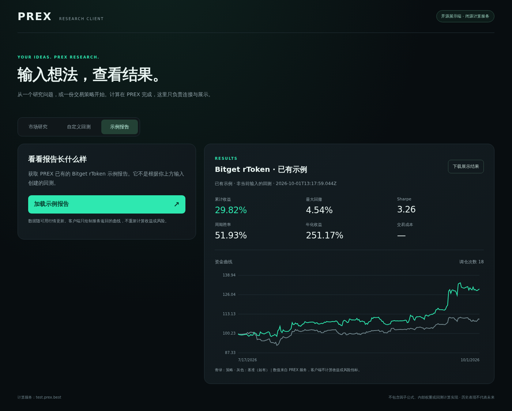

# PREX · Bitget AI 黑客松

PREX 面向普通交易用户，支持通过自然语言、专业表单、完整策略和代码配置构建策略，完成回测、保存、发布、持续跟踪与交易管理。

[进入 PREX AI](https://test.prex.best/start) · [进入策略工作室](https://test.prex.best/strategies?view=backtest) · [已有产品视频](https://drive.google.com/file/d/18hOAWbHKjNPVI5ON2luKm4YQ1UTeMpHG/view?usp=drive_link)

## 公开范围

本仓库公开可运行的展示客户端、输入表单、API 请求、任务查询、结果绘图和使用说明，采用 MIT 许可。

PREX 网站、回测引擎、因子公式、内部权重、策略计算代码及实盘执行系统保持闭源。用户输入问题或策略请求，客户端发送给 PREX 后端，再展示后端返回的结果；不在本地执行回测计算。

## 本地运行展示端

需要 Node.js 20 或更新版本，不需要安装依赖、连接钱包或提供交易所密钥。Windows 也可在 PowerShell 中运行：

```bash
git clone https://github.com/wcq-glhf/prex-bitget-ai-submission.git
cd prex-bitget-ai-submission
npm start
```

在同一台电脑打开 **http://127.0.0.1:4178**，保留终端运行。



截图为 2026 年 10 月 1 日获取的已有示例，不是用户自定义结果或收益承诺。

- **市场研究：** 输入研究问题、标的和周期，PREX 返回基于 Bitget 数据的分析。
- **自定义回测：** 填写 Bitget rToken 参数表单、输入适用市场的自然语言，或粘贴你自己的完整 strategy JSON；提交后查询进度，展示真实返回的收益、回撤、Sharpe 和资金曲线。
- **示例报告：** 单独读取已有的 rToken 示例，不把它冒充为你的自定义结果。

**Bitget rToken 表单**可以填写标的代码、日期、K 线周期、模拟本金、指标、指标计算周期与调仓间隔。它支持简单的单指标排名、现货做多、无杠杆策略；指标名称只是公开接口的选项，不包含指标公式。标的、指标和计算周期由用户自行填写，不预装 PREX 私有示例的策略配方。复杂规则继续使用 JSON 或策略工作室。无效标的、历史不足等由后端校验，不偷偷替换为其他市场或示例。

自然语言回测 API 当前可路由 Binance、OKX 和 Hyperliquid。**Bitget rToken 请使用参数表单、自己的 JSON 配置或 PREX 策略工作室**，展示端会拦截暂未支持的 Bitget 自然语言请求，不会偷换数据市场。表单与 JSON 都是用户自己的参数，不是 PREX 的计算实现；仓库不附带私有策略模板。

默认调用测试环境，沿用现有匿名 API 的限流和客户端 IP 权限，不绕过登录页面或服务器权限。回测时保持同一网络；客户端重启后不保留本地任务访问列表。它只绑定本机地址，不应直接作为公网多用户代理部署。

`npm test` 使用模拟响应验证客户端，不创建远端任务。客户端不保存账户密钥，不自动重试回测提交，不自动交易。下载结果经过字段白名单处理，不带内部排名、因子权重或调仓配置。

**开源的是展示和调用层，不是可以离线独立计算的引擎。** 后端不可用时，客户端也不能自行计算。详细边界见 [架构说明](./ARCHITECTURE.md)。

## 两个项目

- **PREX Market Research Copilot：**AI Trading Desk / Personalized Research Workbench。在原有 AI 助手中使用 Bitget 数据进行单股研究和多股比较。
- **PREX rToken Alpha Lab：**Alpha Factory / rToken Factor Strategies。在原有策略工作室中使用 Bitget rToken 数据配置和评估策略。

这两项研究与回测功能不需要交易所 API Key，也不会自动下单。

## 体验投研

1. 打开 https://test.prex.best/start 并注册或登录。
2. 选择“市场分析”。
3. 输入：“比较 NVDA 和 AMD 的 4 小时趋势，谁更强？依据是什么？什么情况下这个判断失效？”
4. 查看研究结论、行情依据、数据时间与风险提示。

4 小时只是示例，实际周期由用户选择。

## 体验回测

1. 打开 https://test.prex.best/strategies?view=backtest 。
2. 选择构建入口，并在适用入口选择“Bitget · rToken Spot”。
3. 配置自己的标的和策略，确认规格后运行回测。
4. 查看收益、回撤、风险指标和净值曲线。

## 开源结果读取示例

需要 Node.js 20 或更新版本，不需要安装依赖或填写密钥。

```bash
git clone https://github.com/wcq-glhf/prex-bitget-ai-submission.git
cd prex-bitget-ai-submission
npm run report
```

该示例向 PREX 服务请求现有回测报告，不包含选币、因子、模拟成交或收益计算代码。

## 提交说明

[查看两份填表草稿与提交检查表](./SUBMISSION.zh-CN.md)：包含项目介绍、逐行材料链接，以及询问主办方闭源评审方式的中英文消息。模型名称、实际 X 帖链接和官方认可情况仍需确认。

已有视频展示的是 PREX 通用产品和 Binance Agent OS 工作流，不能作为“已录制 Bitget 新功能”的证明。

Alpha Factory 要求附生成报告的代码或 notebook。本仓库的结果读取客户端不满足该代码条款，闭源提交方式需先获得主办方认可。AI Trading Desk 要求完整投研任务演示或录屏，现有产品和视频是否充分，也以主办方审核为准。

历史回测和 AI 研究不代表未来表现。
