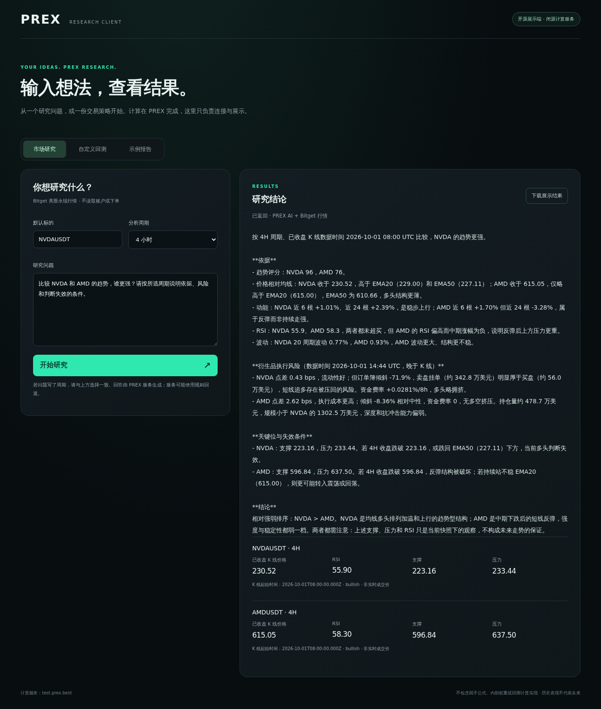

# Actual research task · NVDA and AMD

Captured on **October 1, 2026 at 14:44 UTC** from the hosted PREX test service. This is a recorded API/display-client task, not a recording of the logged-in website and not an executed trade.

## Question and settings

The user selected **4H** and submitted:

```text
比较 NVDA 和 AMD 的趋势，谁更强？请按所选周期说明依据、风险和判断失效的条件。
```

English meaning: Compare NVDA and AMD on the selected timeframe. Which is stronger, what evidence supports the view, and what would invalidate it?

The request used `NVDAUSDT` as the default symbol, with both instruments identified from the question. This research task uses **Bitget stock perpetual markets**, not the rToken spot instruments used by the separate backtest project. No account balance, exchange credential or trading permission was required.

## Returned observations

Response source: `prex-ai+bitget-v3` — model-generated text using supplied Bitget evidence, not the deterministic fallback.

| Market | Timeframe | Closed-candle close | RSI | Support | Resistance |
| --- | --- | ---: | ---: | ---: | ---: |
| NVDAUSDT | 4H | 230.52 | 55.90 | 223.16 | 233.44 |
| AMDUSDT | 4H | 615.05 | 58.30 | 596.84 | 637.50 |

Both candle timestamps were **2026-10-01 08:00 UTC**. These are the start times of the fully closed candles, not quote retrieval times; the prices above are their closing prices, not live executable quotes. The answer separately identified newer derivatives observations at approximately 14:44 UTC.

The generated answer ranked NVDA above AMD, discussed their trend and momentum evidence, compared volatility and execution conditions, and gave conditional invalidation levels. That is an AI interpretation of the snapshot, not an established prediction or a backtested trading result.

## Actual screen



The screenshot shows the actual question, model answer and returned observation cards. It contains no user account, order or wallet information. It is the optional repository client, **not** the PREX website UI. Market data and generated wording will change on later requests.

## Repeat the task

1. Open the [hosted PREX research preview](https://test.prex.best/start), register or sign in, and select **Market analysis**. No trading-account connection is needed.
2. Ask the question above, explicitly including **4 hours** when using the conversational website.
3. Check that the answer refers to both requested symbols and the requested timeframe. Check the candle and derivatives timestamps separately.
4. Alternatively, run the [optional display client](../README.md#open-source-display-client-optional-for-developers), choose **市场研究**, select **4 小时**, and send the question shown above.

## Verification and limits

- Real API checks passed for NVDA 1H, NVDA/AMD 4H, and AMD 1D: the requested instruments and intervals were returned, with non-empty model text and data timestamps.
- The website pages returned HTTP 200. A valid but unauthenticated website assistant request returned HTTP 401; authentication was not bypassed.
- The display client was checked at desktop width and 390 px mobile width, with no horizontal overflow.
- Conversation-context unit tests cover narrow follow-ups such as “风险呢？” and “那换成日线呢？”. This run did **not** verify a logged-in website conversation end to end.
- These are delivery and interface checks, not a benchmark of financial accuracy. AI explanations can still be wrong. RSI is not a calibrated probability; a single order-book snapshot does not prove lasting buy/sell pressure; zero funding does not prove that a position is uncrowded. Verify observations independently before any decision.
- No order, wallet operation or backtest job was created for this record. It does not replace the Alpha Factory requirement for report-generating code, nor establish organizer acceptance of the submission.

## 中文摘要

这是一条真实的 NVDA / AMD 4 小时投研记录：输入问题后，PREX 返回了对应标的的行情依据、AI 分析、风险与失效条件。卡片注明“已收盘 K 线价格”和 K 线起始时间，避免与即时成交价混淆。

截图来自公开展示客户端，不是官网登录后的页面，也不是实盘记录。价格、指标和结论仅代表当时快照；接口成功返回不代表模型解释全部正确。本材料只公开问题、输出和展示，不公开 PREX 因子公式、私有提示词或回测计算实现。
